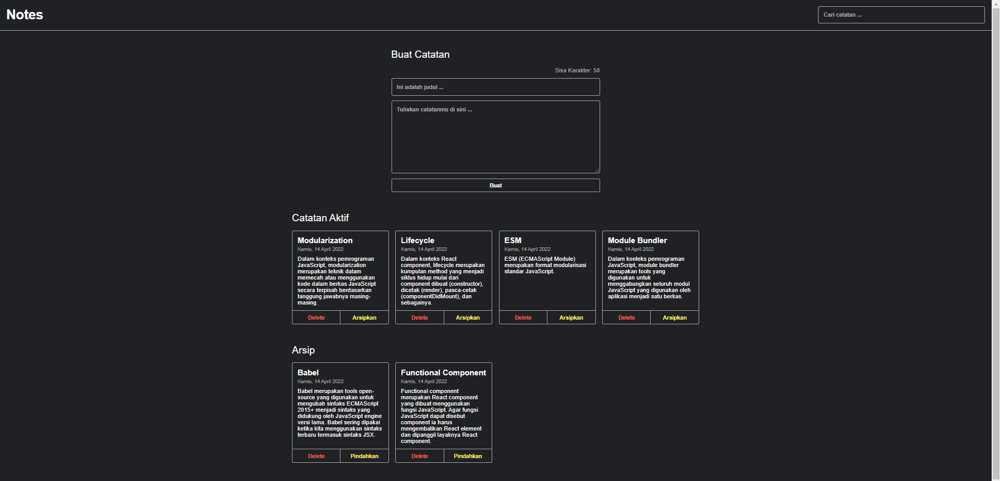

# Personal Notes
Proyek React Personal Notes adalah aplikasi berbasis React yang memungkinkan pengguna untuk membuat, mengedit, dan menghapus catatan pribadi mereka. Aplikasi ini dirancang untuk membantu pengguna menyimpan ide-ide, tugas, atau hal-hal penting dalam format catatan yang mudah diakses dan dikelola. Berikut adalah deskripsi umum untuk proyek React Personal Notes:

## Fitur Utama:
**Menambah Catatan:** Pengguna dapat membuat catatan baru dengan memasukkan judul dan isi catatan. 
**Mengedit Catatan:** Pengguna dapat mengedit catatan yang telah dibuat sebelumnya. 
**Menghapus Catatan:** Pengguna dapat menghapus catatan yang sudah tidak diperlukan. 
**Penyimpanan Data:** Catatan disimpan di localStorage atau bisa menggunakan backend API untuk penyimpanan jangka panjang (misalnya menggunakan Firebase atau server custom). 
**Antarmuka Pengguna (UI) Sederhana:** Desain antarmuka yang sederhana dan mudah digunakan, dengan daftar catatan yang dapat diakses dengan cepat. 
**Pengelompokkan Catatan:** Kemampuan untuk mengelompokkan catatan berdasarkan kategori (misalnya pekerjaan, pribadi, dll), meskipun fitur ini dapat ditambahkan sebagai pembaruan di masa depan. 
**Filter & Pencarian:** Pengguna dapat mencari catatan berdasarkan kata kunci tertentu untuk mempermudah pencarian. 

## Teknologi yang Digunakan:
**React.js:** Untuk membangun UI aplikasi dengan pendekatan komponen. 
**State Management:** Menggunakan React state atau Context API untuk mengelola status aplikasi (misalnya catatan). 
**localStorage:** Untuk menyimpan data catatan secara lokal di browser pengguna. 
**CSS/Styled Components:** Untuk mendesain antarmuka aplikasi agar responsif dan mudah digunakan. 

## Manfaat:
Membantu pengguna mengatur catatan pribadi mereka dengan cara yang lebih terstruktur dan efisien. 
Aplikasi yang ringan dan mudah digunakan, cocok untuk aplikasi sehari-hari. 
Proyek ini sangat berguna bagi siapa saja yang ingin memahami cara membuat aplikasi frontend menggunakan React, serta belajar tentang cara mengelola status dan penyimpanan data dalam aplikasi React. 
